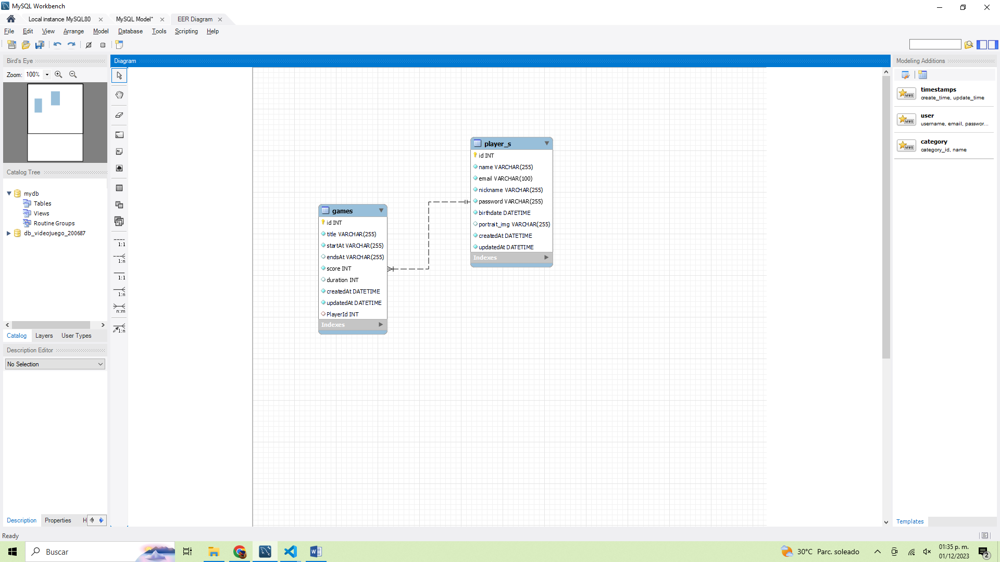

# DMI_PRACTICA_18_200687

# Universidad Tecnológica de Xicotepec de Juárez

## Ingeniería en Desarrollo y Gestión de Software
## Josseline Alvarado Vargas
## Lesly Yareth Hernandez Bonilla
## Jose Luis Galindo Picaso
## 10A
### Desarrollo Móvil Integral

## Descripcion

Esta aplicación de videojuego llamada Api Rest es un CRUD que se conectará a la aplicación integrada, pero ¿qué es CRUD? CRUD es la abreviatura de "Crear, Leer, Actualizar y Eliminar", que se utiliza para referirse a las funciones básicas en la base de datos o la capa de persistencia en el software, en pocas palabras, es la abreviatura de la forma de operar el almacenamiento. Información, el objetivo es poder mostrar el progreso o evolución de CRUD, cuya finalidad es poder conectarse a la API de TecnoGames Team. En este nuevo desarrollo se ha implementado una implementación de búsqueda en nuestro CRUD para poder buscar jugadores insertados en la base de datos, y también se ha incorporado la posibilidad de insertar datos de jugadores.
Modelo reverso de la base de datos
# Capturas de la Ruta

## Captura De las Rutas

La implementación de rutas para realizar operaciones CRUD (Crear, Leer, Actualizar y Eliminar) en una aplicación es una parte esencial de muchos sistemas informáticos, especialmente en entornos weB. En esta captura se muestra las rutas creadas, las cuales Define rutas específicas para cada operación CRUD. Esta se asocia a cada operación CRUD con un método HTTP específico:
 * POST para la creación.
 * GET para la lectura.
 * PUT o PATCH para la actualización.
 * DELETE para la eliminación.

## Capturas de Pantalla de la Actividad

  
 
